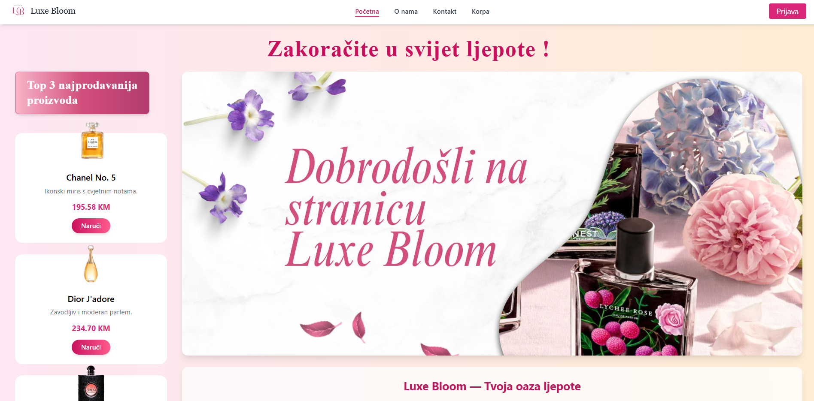
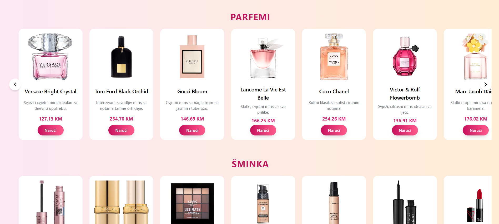
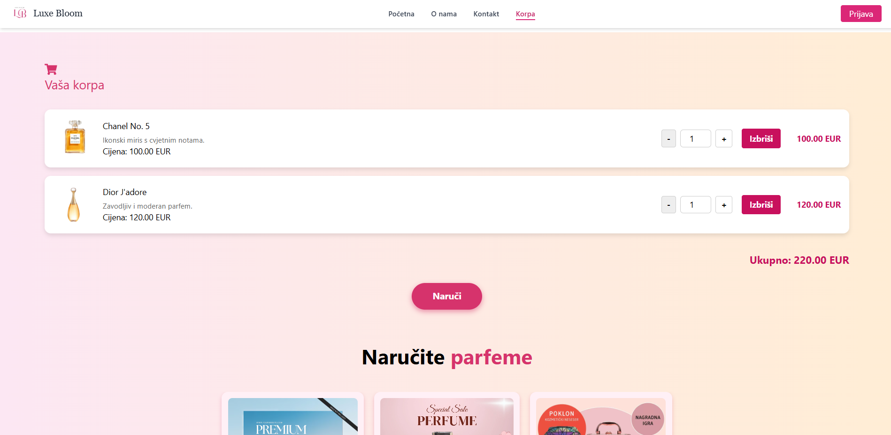
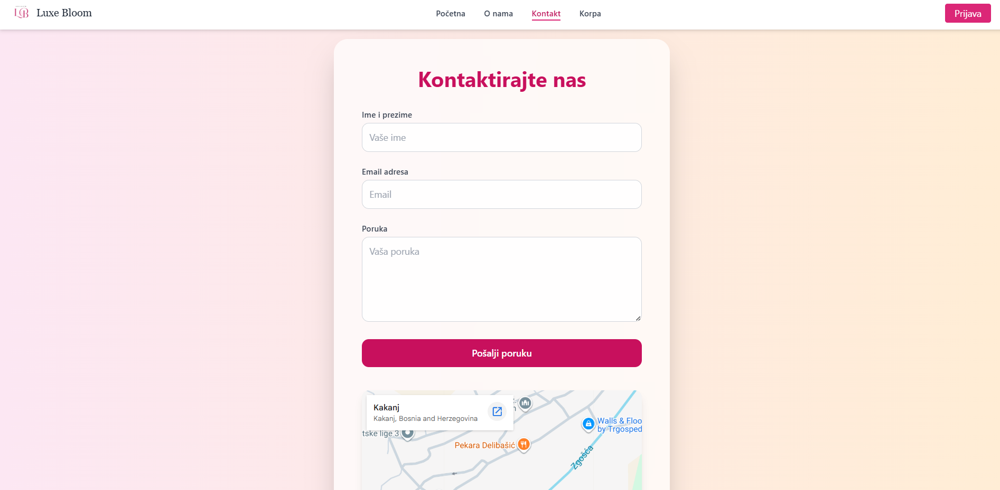

# 🌸 Luxe Bloom

A modern and responsive web application for discovering and exploring perfumes and cosmetics.

**Luxe Bloom** is a React-based web project developed as a frontend application with a simulated backend. The application provides product browsing, authentication, shopping cart functionality, favorites, contact form and an admin section for managing products.

---

## ✨ Features

- 🏠 Modern landing page
- 💐 Perfume and cosmetics product catalog
- 🔎 Product browsing and details
- ❤️ Favorites functionality
- 🛒 Shopping cart
- 👤 User authentication
- 🔐 Admin and guest roles
- ➕ Admin product management
- 📩 Contact form
- 🗺️ Google Maps integration
- 📱 Responsive design
- 💾 JSON Server mock backend
- ⚡ React Context for cart management
- 🎨 Tailwind CSS styling
- 🧭 React Router navigation

---

## 🛠️ Technologies

| Technology | Purpose |
|---|---|
| ⚛️ React | Frontend framework |
| 🟨 JavaScript | Programming language |
| 🎨 Tailwind CSS | Styling and responsive design |
| 🧭 React Router | Application navigation |
| 🟢 Node.js | Runtime environment |
| 📦 npm | Package management |
| 🗄️ JSON Server | Mock REST API |
| 🔧 Git | Version control |
| 🐙 GitHub | Code hosting |

---

## 📸 Project Preview

### 🏠 Main Page



### 💐 Perfumes



### 🛒 Shopping Cart



### 📩 Contact



---

## 📦 Installation

Clone the repository:

```bash
git clone https://github.com/AminaHeljaa/Projekat_Luxe-bloom.git
````

Open the project folder:

```bash
cd Projekat_Luxe-bloom
```

Install the required dependencies:

```bash
npm install
```

---

## ▶️ Running the Application

Start the React development server:

```bash
npm start
```

The application will be available at:

```text
http://localhost:3000
```

---

## 🗄️ Running the JSON Server

The project uses JSON Server as a mock backend.

Start the JSON Server with:

```bash
npx json-server --watch db.json --port 5000
```

The backend will be available at:

```text
http://localhost:5000
```

### Available API Resources

```text
http://localhost:5000/proizvodi
http://localhost:5000/korisnici
http://localhost:5000/poruke
```

---

## 🏠 Main Pages

### Home

The home page contains:

* Hero section
* Featured products
* Navigation
* Product categories
* Promotional sections
* Responsive layout

### Products

Users can browse available perfumes and cosmetic products.

Each product contains information such as:

* Product name
* Price
* Description
* Category
* Image

### Favorites

Users can add products to their favorites and easily access them later.

### Shopping Cart

The shopping cart allows users to:

* Add products
* Remove products
* Change quantities
* View the total price

The cart state is managed using React Context.

### Profile

Users can access their profile and account-related functionality.

### Contact

The contact page contains a validated contact form and a Google Maps section.

---

## 🔐 Authentication

The application contains a simple simulated authentication system using JSON Server.

Users can log in using their credentials.

The application supports different user roles:

* 👤 Guest/User
* 👑 Admin

The admin has access to additional functionality for managing products and viewing submitted contact messages.

---

## 👑 Admin Panel

The administrator can:

* ➕ Add new products
* ✏️ Manage products
* 🗑️ Delete products
* 📩 View contact form submissions

The admin section is protected through the application's authentication logic.

---

## 🛒 Shopping Cart

The shopping cart is implemented using React Context.

Main functionality includes:

```text
Add product
     ↓
View cart
     ↓
Change quantity
     ↓
Calculate total
     ↓
Remove product
```

The cart can be accessed through the navigation menu.

---

## 📩 Contact Form

The contact form allows users to send messages.

The form includes validation for:

* Name
* Email
* Message

Submitted messages are stored using the JSON Server mock backend.

---

## 🗺️ Google Maps

The contact page includes an embedded Google Maps location to provide users with a visual representation of the store/location.

---

## 📱 Responsive Design

Luxe Bloom is designed to work on different screen sizes:

* 💻 Desktop
* 💻 Laptop
* 📱 Tablet
* 📱 Mobile

The layout adapts using responsive Tailwind CSS classes.

---

## 📁 Project Structure

```text
Projekat_Luxe-bloom/
│
├── 📁 public/
│
├── 📁 src/
│   ├── 📁 components/
│   ├── 📁 pages/
│   ├── 📁 context/
│   ├── 📁 hooks/
│   ├── 📁 services/
│   ├── App.js
│   └── index.js
│
├── 📄 db.json
├── 📄 package.json
├── 📄 package-lock.json
├── 📄 README.md
├── 🖼️ glavna.png
├── 🖼️ parfemi.png
├── 🖼️ korpa.png
├── 🖼️ kontakt.png
└── 📄 .gitignore
```

---

## 💾 Backend

The project uses **JSON Server** as a simulated backend instead of a production database.

The following resources are available:

| Resource     | Description      |
| ------------ | ---------------- |
| `/proizvodi` | Products         |
| `/korisnici` | Users            |
| `/poruke`    | Contact messages |

Example product:

```json
{
  "id": 1,
  "naziv": "Example Perfume",
  "cijena": 50,
  "opis": "A beautiful fragrance",
  "kategorija": "Parfemi"
}
```

---

## 🧭 Navigation

The application contains navigation to the main sections:

```text
Početna
O nama
Proizvodi
Favoriti
Korpa
Profil
Kontakt
```

The available navigation may depend on the user's authentication status.

---

## 🧪 Testing

The application was tested manually through:

* 🌐 Web browser
* 🗄️ JSON Server
* 👤 User authentication
* 🛒 Shopping cart
* ❤️ Favorites
* 📩 Contact form
* 👑 Admin functionality
* 📱 Responsive layouts

---

## 🔄 Application Flow

The main user flow is:

```text
Open Luxe Bloom
       ↓
Browse products
       ↓
View product details
       ↓
Add to favorites / cart
       ↓
Manage shopping cart
       ↓
Login / Register
       ↓
Use account functionality
```

### Admin Flow

```text
Admin Login
     ↓
Admin Panel
     ↓
Manage Products
     ↓
View Contact Messages
```

---

## 🎨 Design

Luxe Bloom uses a modern beauty and cosmetics visual style with:

* Clean layouts
* Product cards
* Soft visual elements
* Responsive components
* Modern navigation
* Consistent typography
* User-friendly interface

---

## 🚀 Future Improvements

Possible future improvements include:

* 💳 Real payment integration
* 🗄️ Production database
* 🔐 More advanced authentication
* 📦 Order management
* ⭐ Product reviews and ratings
* 🔍 Advanced product filtering
* 🔔 Notifications
* ☁️ Deployment to a production server

---

## 👩‍💻 Author

**Amina Helja**

Software Engineering Student

**Politehnički fakultet – University of Zenica**

---

## 📄 License

This project was created for educational purposes as part of a web development project.

````


